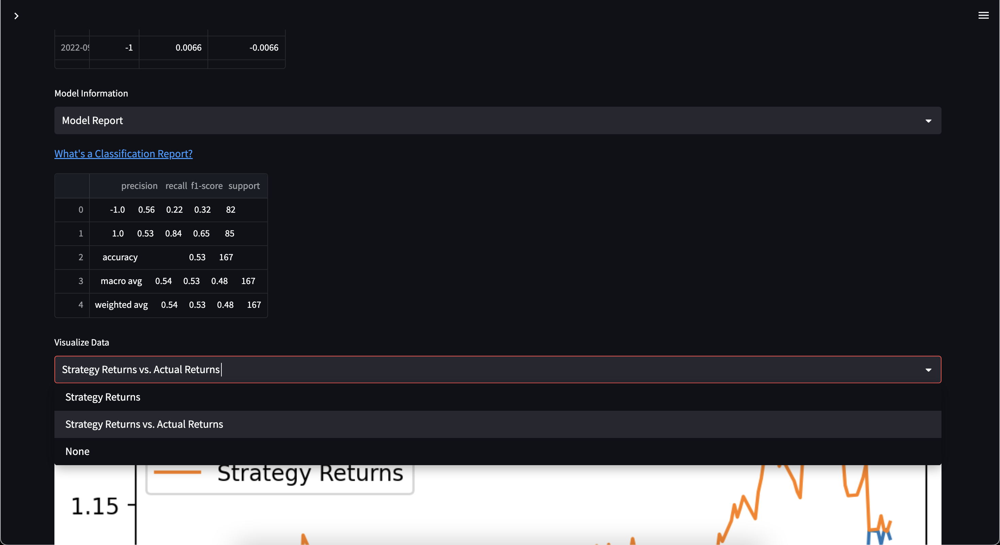

# Algorithmic Trading Model Generator
Streamlit application, for informing trade-decisions

## Background

This project aims to create a financial analysis app built with the Streamlit framework. The app allows users to select a portfolio of stocks, adjust the weights of each stock in the portfolio, and analyze various financial metrics of the portfolio. The code retrieves historical stock data from the Alpaca API and calculates various metrics such as volatility, variance, beta, and Sharpe ratio using functions from a separate financial analysis module. The app displays the portfolio data as well as the data for individual stocks in the portfolio in dataframes, and provides explanations of the financial metrics displayed. The app also uses a Monte Carlo simulation to forecast returns based on the historical data. Finally, the app prompts users to learn more about portfolios and financial metrics by providing links to relevant Investopedia articles. 

The application will allow users to quickly and easily interact with live stock data, and add stocks together to create customizable portfolios, with the added functionality of indicating the specific asset weights, and initial investment value for each asset in the portfolio. 

The application pulls is live stock data via. the Alpaca API, and creates a dataframe with the assets information over the specified timeframe. The API data is pulled in in real-time-- data as recent as one day prior may be pulled in, which is a limitation of utilizing the free Alpaca paper account. 

The project may be used to generate summary statistics, and retrieve historical trends data from numerous assets, and also allows for assets to be compared to one-another, meaning the application's functionality exceeds that of a simple portfolio curator, as the application is not meant to curate a portfolio, and is instead meant to inform trade decisions. 

The project focuses on utilizing stock data to train different algorithmic trading models, which will try and predict trade signal calls. The user may directly interact with both the short and long moving averages, aswell as the choose the specific sklearn model they wish to fit to the training data. By reviewing the summary statistics and numerous visualization options available, this project aims to provide users with an understanding of backtesting, model training, and model optimization for algorithmic trading. The main segment of the application, and the focus of the whole project is the 'Algoritmic Trading' Page.

## Instructions and Features

Once the repository is pulled in via. Github, access the 'UCB_Project_2' file via terminal, and access the streamlit application by inputing : 
    ''' streamlit run Home.py'''
    

Once accessed, you may interact with the streamlit application directly using the numerous buttons and widgets offered to the user. In order to ensure that the application runs smoothly, it is suggested that the user take the time to interact with each page completely before moving on to the other pages, as some variables may need to be initialized early in the application so that they are ready for any future-use. 

In order for the user to interact with the application to any capacity, the initial 'Generate Portfolio' page must be accessed, and assets must be selected for the user to interact with the applicaion in any capacity. 

**Please review the specific features available within the pages below.**
    

### 01-Generate Portfolio

This page allows users to select multiple stocks and generates a portfolio that tracks the selected assets. The page fetches the closing price data of the selected stocks from Alpaca's API and concatenates the data to create a DataFrame that contains the portfolio data.

The app has the following features:
- A search bar for selecting assets
- A select box for selecting a timeframe
- A button to generate the portfolio
- Error messages for invalid inputs
- Data caching to improve app performance

### 02-Technical Analysis

This page allows user to generate historic summary statistics related to their selected assets, the page allows users to analyze the specific assets within the portfolio, compare assets, and visualize the different assets within the portfolio. Many visualizations are saved in the project folder, inside the 'data' subfolder for future use within the application, and for users to export the live data for use elsewhere. 

The app has the following features:

- An input for the initial investment value
- A sidebar input for interacting with the weights
- A multiselect box for generating summary statistics for specific assets. 
- The ability to generate numerous financial metrics such as the standard deviation, annualized returns, volatility, sharpe atio, and sortino ratio of the assets in question. 
- A 'View Dataframes' section for directly viewing the data to be used later in the application.
- A 'View Plots' section for visualizing the asset data, and comparing the numerous assets within the portfolio. 

### 03_Forecast Returns

The Forecast Returns page allows the user to generate monte carlo simulation forecasts, based on historical price data, to better understand what the future performance of a stock may look like. Though past performance is never indiciative of future results, and forecasts are not future predictions but indicators of past performance-- the range of possible outcomes provided may help investors better understand the downside risks of their investments. 

More volatile stocks with major disrepencies in their price data will have a more pronounced spread of forecast results, narrowing the spread based on past results can help minimize downside risk within a portfolio. 

Please note that, in regards to the 'number of simulations to run' input, the greater the number of simuations, the more and more accurate the generated forecast will become. Also important to know is that the more data available in the prices dataframe, the more accurate the forecast will become. Therefore, in order to generate an accurate forecast it is suggested that the user select a timeframe of '5 years' in the 'Generate Portfolio' page, and run as many simulations as possible. If using the application for educational purposes, it is not recommended to exceed 1000 simulations. 

The app has the following features:

- Sliders for selecting the number of simulations, and number of years to forecast.
- The ability to remove excess dataframe features via a multiselect box.
- The ability to interact with the initial investment. 
- Options to visualize a line-plot forecast aswell as a distribution plot for the forecasted future standard deviation of the portfolio
- Under the 'options' selectbox, the user can view summary statistics related to the forecast.

### 04_Algorithmic Trading

The algorithmic trading page is the main focus of the project, and takes up most of the skope of this project aswell. The algorithmic trading section allows users to generate a machine learning model, and fit the model to the specific asset selected at the top of the page via a selectbox. The user is able to select the short ang long simple moving averages, and then review the input data used to train the model. Such interactivity via a frontend allows users to understand how changes in data and trading strategies can significantly influence model performance, and potential returns when using algorithms to supplement traditional asset analysis. 

The user can view the features, training data, scaled data, and access numerous links summarizing the steps of creating a model via streamlit links. After inputting data, the output data can also be reviewed. 
Under 'Model Information', the user can access the score report, with a link added to help the user descern the reports contents. Visualizations are also provided, so that the user can view the models performance in generating trade signals, and compare it with the performance of the regular strategy. Such plots can be used to identify overfitting, and the behaviour of the model of the selected timeperiod.

Under 'Improve Model Performance', the user may select a new machine learning model from the sklearn library, and are provided with links to help understand how the numerous models differ from one another. The user is provided a selectbox, to select and instantiate a model of their choice. Underneath, they are also provided with visualizations of the performance, and are able to save the plots to their computer via a 'Save Plot' button.

Finally, in the 'Trade Evaluation' section, the user can delve deeper into their models performance, through advanced visualizations and evaluation metrics such as an interactable plot displaying the profits of each individual trade generated by the model, and understanding how profitable the model would have theoretically ben had it ben used. Returns, volatility, and the cumulative returns of the portfolio are also provided. The quick-to respond application can be used to continuously tweak the inputs, such as the sklearn model and the slow/fast SMA's to better understand how trade signalling works.  

Hvplot's interactable visualizations are used in this page of the application, allowing users to interact with scatter plots, and identify trends in the data. 

Finally, the user is able to save the model in their computer by selecting the 'Save Model' button, to be used as desired by the user!

## Technologies

This project uses several imported modules, that provide users with the experience of the application. Please find further information and documentation on these modules below:

### Required Modules

The following modules were used in this project:

- **Streamlit**: A popular Python web application framework that allows developers to create and deploy interactive web applications with ease. Streamlit provides various tools for building interactive data visualizations, creating forms, and deploying machine learning models.

    - PyPI package: https://pypi.org/project/streamlit/
    
- **dataclasses**: A module that provides a decorator and functions for creating classes that can be used to store data in a structured format. This module simplifies the process of creating structured data classes in Python.

    - Python documentation: https://docs.python.org/3/library/dataclasses.html
    
- **typing**: A module that provides various types and classes for type hinting in Python. Type hinting is used to specify the expected type of a variable or function parameter, which can improve code readability and maintainability.

    - Python documentation: https://docs.python.org/3/library/typing.html
    
- **datetime**: A module that provides various classes for working with dates and times in Python. This module provides functionalities such as creating, manipulating, and formatting dates and times.

    - Python documentation: https://docs.python.org/3/library/datetime.html
    
- **pandas**: A module that provides tools for data manipulation and analysis. This module is widely used in the finance industry to organize financial data and perform advanced decision-making.

    - GitHub repository: https://github.com/pandas-dev/pandas
    

- **Sklearn (scikit-learn)**: A popular Python library for machine learning. It provides various tools for data preprocessing, feature selection, model selection, and model evaluation. Scikit-learn is built on top of NumPy, SciPy, and matplotlib, and is designed to be easy to use and understand.

    - GitHub repository: https://github.com/scikit-learn/scikit-learn

- **HoloViews (hvplots)**: A Python library for building interactive visualizations for data exploration and analysis. It provides a high-level interface for creating complex visualizations using a declarative syntax. HoloViews is built on top of Bokeh, Matplotlib, and NumPy, and is designed to be easy to use and customizable.

    - GitHub repository: https://github.com/holoviz/holoviews

- **Alpaca Trade API**: A Python library for accessing the Alpaca Securities API, which provides a commission-free trading platform for stocks and ETFs. The Alpaca Trade API provides various functionalities for placing orders, managing positions, and retrieving market data.

    - GitHub repository: https://github.com/alpacahq/alpaca-trade-api-python

- **NumPy**: A Python library for scientific computing. It provides various tools for working with arrays, matrices, and other numerical data structures. NumPy is widely used in the scientific community for data analysis, machine learning, and numerical simulations.

    - GitHub repository: https://github.com/numpy/numpy

- **SQLAlchemy**: A Python library for working with databases. It provides a high-level interface for managing database connections, executing queries, and working with database tables. SQLAlchemy supports various database systems, including SQLite, MySQL, PostgreSQL, and Oracle.

    - GitHub repository: https://github.com/sqlalchemy/sqlalchemy

- **Tweepy**: A Python library for accessing the Twitter API. It provides various functionalities for searching and retrieving tweets, managing user accounts, and streaming live tweets. Tweepy is widely used for social media analysis and sentiment analysis.

    - GitHub repository: https://github.com/tweepy/tweepy

    
## Usage

### Instructions :

#### 1. Install Streamlit

    '''pip install streamlit'''

#### 2. Open the terminal or command prompt and navigate to the directory where the pychain_demo.py file is saved.

#### 3. Run the app

    '''streamlit run Home.py'''

#### 4. Access the app

 Once the app is running, you should see a message similar to "You can now view your Streamlit app in your browser at: http://localhost:8501/". Open your web browser and navigate to that URL to access the app.

#### 5. Interact with the app

Once you have accessed the app, you can interact with it using the widgets on the left-hand side. For example, you can add a new block to the blockchain by entering data into the text box and clicking the "Add Block" button. You can also view the current state of the blockchain by clicking the "View Blockchain" button.

#### 6. Try out different features
 Play around with the different features of the app to get a feel for how it works. You can also modify the code in pychain_demo.py to customize the app to your liking.
---

## Contributors

The sole contributor for this project is:

**NAJIB ABOU NASR**
 no instagram or linkedin yet!
---

## License

Using the 'MIT' license!
--- 

